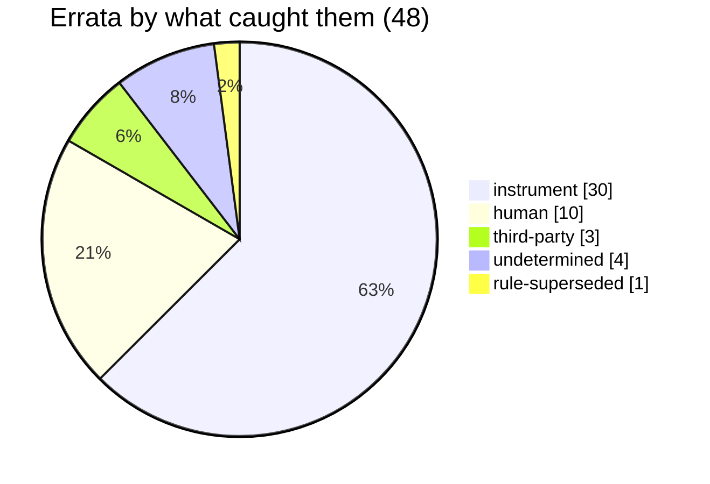

# Errata

   

> [!NOTE]
> Every claim this project graved in its journal or published on a public surface that later proved **false**, with **what caught it** and **what is true**. The internal register is append-only: a wrong sentence is never rewritten, it receives a line here. This file is **generated** from that register by `outils/sync_errata.mjs` at every engraving and is never edited by hand; the table it renders is pinned by its SHA-256 below, so a reader can check that the rendering matches the source.

Generated 2026-09-07 15:31Z from the ERRATA block of the internal journal, 48 rows, source block sha256 `875107d6a2531a994e156d11949faace5103615f4f11bb19056a66761ff927a2`. Machine-readable copy: [`errata.json`](errata.json). Claims published in *this* repository and the commits that fixed them are listed separately in [CORRECTIONS.md](CORRECTIONS.md); why the register exists, and what it could not tell us, is in [WHAT-CAUGHT-IT.md](WHAT-CAUGHT-IT.md).

## What caught it

The column that matters. A falsehood caught by an instrument was caught by something a third party can re-run; one caught by a human was caught by attention, which does not scale; one caught by a third party was caught because a surface was public.

| class | meaning | count |
|---|---|---:|
| `instrument` | an instrument or a measurement, not a reader | 30 |
| `human` | a human (the maintainer, or a fresh instance reading with no context) | 10 |
| `third-party` | someone outside the project | 3 |
| `undetermined` | not attributable to a detector | 4 |
| `rule-superseded` | not a false claim: a rule that was reversed | 1 |

## The register, newest first

| # | caught by | found in | what was published or graved | what is true, and how we know |
|---|---|---|---|---|
| **E47** | `instrument` | J106 (2026-09-04) | **A property declared in a tool's notice that its code did not have** The door probe's notice said it measured two channels separately, pull requests and issues, and reported both. | The code only read pull requests; the "issue" comments it counted were PR comments, and the JSON output had no issue field. A published 9/9 issue score had been counted by hand. Fixed the same evening: a pure issue classifier with four states never merged into the PR score, bench 33 to 48 cases. |
| **E48** | `instrument` | J106 (2026-09-04) | **Repository "door" verdicts rendered on truncated lists** Several external repositories were rated GREEN / RED / MUTE by the door probe, run without an API token. | Unauthenticated, the API truncates pull-request lists: on one repository the authenticated probe read 13 PRs where the anonymous one read 3. The numbers were right, the denominator was not. The probe now refuses to conclude without a token, and every cited door was re-measured with one. |
| **E46** | `instrument` | J106 (2026-09-04) | **The house counted among the visitors** A repository was given as a dead door because one of its pull requests had been open for 451 days. | Its three open PRs were from two collaborators and a bot: no outside contributor was waiting. The manual count mixed maintainers with visitors; the instrument partitions on who merged and rates the door ORANGE, which is not "closed to outsiders". The world had not moved, our measurement was wrong. |
| **E44** | `instrument` | J103 (2026-08-31) | **An inference published in the present tense of an observation** A public issue comment stated, in the present tense of an observation, that in a real browser the Cloudflare interstitial renders and then the site does, so the site is up. | We never saw the site. The browser rendered the interstitial and nothing else: zero later requests, zero real-content markers. Found by four refuters run against our own sentences, then corrected by editing the same comment 45 minutes later with a note saying what changed. The recommendation survived: treat a challenge header as inconclusive precisely because we do not know. |
| **E43** | `instrument` | J101 (2026-08-28) | **A correct mechanism used as a wrong argument, in public** A PR comment presented a configuration-time case as "the same shape" as the defect the PR fixed. | The cited state is set at execution time, not declared in policy, so no load-time check can reason about it; the parallel did not hold. Found two greps after posting by searching for what would break our own sentence, never by a run. Corrected by editing the same comment 25 minutes later, with a note. |
| **E42** | `human` | J99 (2026-08-27) | **A graved "not posted yet" that had been posted for four days** The journal said a reply on an OWASP thread was ready and not posted, and two later entries repeated it. | It had been posted four days earlier and was the last message of the thread, measurable by one API call. A graved line is true at its date and becomes a cache of unknown freshness the moment the world moves. A leftover that names a public surface is re-measured before being carried forward, never copied. |
| **E41** | `instrument` | J94 (2026-08-21) | **A correct figure with its meaning inverted** A paper's "-8.6 points" was read as the utility cost of adding a human approval gate. | In the paper, the interactive condition is the one WITH human approval, and -8.6 is better than the strict condition's -13.9: the gate gains 5.3 points, it does not cost 8.6. Caught by fetching the paper body before citing it; no public text ever carried the wrong reading. |
| **E40** | `human` | J93 (2026-08-20) | **What an anonymous fetch can do is not what an account can do** A draft said issue creation was restricted on a repository, on the strength of an unauthenticated fetch. | The form was open, and our issue #1 was created there the same evening. An anonymous fetch measures what an anonymous visitor can do, never what the account can do; the positive control was missing. Caught by the maintainer with a screenshot before the draft left. |
| **E39** | `human` | J92 (2026-08-18) | **A remedy that existed and protected nothing** The journal said a monitoring report no longer printed amounts it could not qualify, and that the fix was live in production. | The rendered object reduced the on-chain verdict to a boolean, so the "measurable" flag was always true and the report would have printed amounts even on a mute scan. The bench checked that the right strings existed in the source, not the flow of the value. Caught because the maintainer demanded a manual run instead of waiting for the cron; fixed and deployed the same day, with a flow check in the bench. |
| **E37** | `instrument` | J89 (2026-08-18) | **A function selector written by hand in the sentence that forbade it** A contract selector was quoted as one 4-byte value in prose, documentation and a bench. | Measured on three disjoint channels, the selector is a different value; the code always computed it at run time, so no behaviour was ever wrong, only prose. The bench could not catch it: it fabricated bytecode containing its own constant and then found it there. Structural remedy: the selector is computed in the bench, and a parity test refuses any 4-byte literal in the shared block. |
| **E31** | `instrument` | J78 (2026-08-10) | **An off-by-one in a procedure, followed to the letter, targets an existing token** A pre-flight step said the next token id equals the current total supply. | The contract increments first, so the next id is total supply plus one; measured on a live cycle (26 before mint, token 27 minted). Closed by an instrument that computes the id from the contract; the dated document keeps its wrong line and carries an erratum pointer instead of being rewritten. |
| **E32** | `instrument` | J78 (2026-08-10) | **A tool alias assumed universal was directory-scoped** Procedures used a named RPC alias everywhere. | The alias only exists inside one project directory; elsewhere the tool reads it as a file path and fails. Cost one failed mint attempt. The pre-flight instrument now emits the literal URL. |
| **E1** | `instrument` | J42 | **A "sourced" 60 s ceiling pointing at a line that said nothing of the kind** A tool-call ceiling was attributed to a specific source line, under a "sourced reason" label. | That line is an unrelated configuration guard. The ceiling was unsourced until it was measured: 60,000 ms to the millisecond. The architectural conclusion survived on its other, correctly sourced leg. |
| **E2** | `instrument` | J42 | **A "fixed at construction" address that the owner could redirect** The journal and the public site said the curator address was fixed in the constructor. | The deployed bytecode carries an owner-only setter for it. The address is initialised at construction and redirectable by the owner; the real debt is "not dynamic per auction". The false claim had crossed the journal and the public site before being caught by reading the bytecode. |
| **E3** | `instrument` | J42 | **A self-audit that refuted a real 45-second window by looking at the wrong clock** An earlier claim that the maintainer had only 45 seconds to confirm was declared false because the client had no timeout. | The server side had a 45,000 ms timeout and abandoned the pending action regardless of the client. The refutation aimed at the wrong clock; the self-audit that denounced "invented obstacles" was wrong on one of its two examples. |
| **E4** | `human` | J42 | **True of the contract, false of the key ring** Settlement was described as callable by any funded wallet, with no hardware device and no secret needed. | True of the contract; false in practice, because every funded wallet sat behind a hardware signer or a paper password and the free keys held zero ETH by design. No "free" path existed. Same family as E7: right property, wrong sentence. |
| **E5** | `rule-superseded` | J42 | **Not a false claim: a rule that was reversed** A rule said canonical backups were purged after upload. | Reversed: the rule destroyed the version history of the document that carries the project's priority evidence, leaving the journal with weaker traceability than the code. Backups are now moved to a history folder and never purged. |
| **E8** | `instrument` | J46 | **A capability the device has, and refuses to use for us** The state of the art said the hardware device already knows how to sign a delegation. | On silicon, the device parses the delegation and refuses any target outside its allow-list: "Back to safety". True as a capability, false in practice for a bespoke contract; a whole path closed by a two-minute test on the device. |
| **E9** | `undetermined` | J47 | **A submission recorded as "frozen" that had been sent** A status block listed a partner-program submission as unchanged and frozen. | It had been unfrozen and submitted two entries earlier, confirmed on screen by the maintainer. The error was introduced while assembling the status block, not while measuring. |
| **E10** | `undetermined` | J47 | **Eight months of solo work that were four** Public texts spoke of eight months of continuous solo work. | The project started on 1 April 2026: about four months at the time. Corrected on the public project page; two locked applications still carry the error and cannot be edited. |
| **E11** | `instrument` | J53 | **A green invariant suite covering an almost empty state** A 54/54 invariant suite was presented as real coverage, tested under random sequences. | The campaigns produced one to three accepted bids, zero winning settlements and zero claims per run: six stateful invariants were green on a near-empty state, and the one that graved a regulatory decision had an empty loop body. Found by a sensitivity probe added the same day; the green was real, the coverage was not. |
| **E12** | `instrument` | J55 | **A ceremony said to be wasted after the human confirm, that failed before it** A handover said a stale-selector transaction would revert only after the human confirmation and password. | Gas estimation runs before the transaction is frozen and before any human is asked, so the failure surfaces first. But the guarantee is an ordering accident, not a guard: freezing gas or skipping estimation would move the failure back behind the confirm. The real vector for a burned ceremony is time, not the stale ABI. |
| **E13** | `instrument` | J55 | **An "exhaustive" list of four components that were eight** A handover listed the four remaining off-chain components as exhaustive. | Measured: seven code files and one document, including a validation bench that encoded the old interface, a verbatim copy of a scanner carrying the same defect twice, and three event decoders that appeared in no catalogue. |
| **E14** | `instrument` | J55 | **A specification document three items out of date, left intact with a pointer** A specification described an anti-sniping buffer, a sketched bid signature and a settlement name, and declared itself to be graved before the contract was written. | The buffer had been removed, the real signature and selectors differ, and the contract was already written. The document body is left byte for byte; an erratum sits at its head. A dated document receives a pointer, it is not rewritten. |
| **E15** | `undetermined` | J56 | **A contradiction and an arbitration that did not exist** Two documents were said to contradict each other on cycle duration ("1 h vs at least 3 h"), presented as the only measured vector for a burned ceremony and as a decision for the maintainer. | One states a floor, the other satisfies it. The margin was also over-escalated: the worst anti-snipe case was presented as the common case. A prudence pointer, not a conflict erratum. |
| **E16** | `human` | J62 | **A royalty figure wrong by one thousandth, and the cited source was what falsified it** The facts register said 8.333 % creator royalty, under a source line claiming splits verified to the wei. | The on-chain value is 833 basis points, i.e. 8.33 %; the addition decides (8.33 + 45.835 + 45.835 = 100.000, where 8.333 gives 100.003). Found by reading a public note that faithfully copied the register: the copy was not at fault, the source was. Corrected at the source and publicly in the same pass. |
| **E16b** | `instrument` | J62 | **E16, one link further: the root is a frozen comment in the verified contract** The E16 line stopped at the register and blamed it. | The root is the contract's own source comment ("833 for 8.333%"), which the register cited. The file is byte-identical to the source verified on chain, and a single whitespace change would break that verification. E16 is documented, not repaired: editing the comment would make the repository copy non-reproducible against the chain. |
| **E17** | `human` | J63 | **Two successive causal explanations for a fault whose cause is unknown** The journal explained a wrong rule first by a translation from a field still carrying an old hardening, then by a field that was never updated. | Both were false: the field carried the corrected version, measured before any rewrite. The cause of the original fault remains unknown; what got explained were the explanations. A causal explanation produced without measurement is a state assertion. |
| **E18** | `instrument` | J65 | **"Ten months apart" was 39 days** An article draft said two rule sets were elaborated ten months apart, and the journal graved it. | First commits: 20 June and 29 July 2026, 39 days. The whole project was four months old. Caught the same evening by the git audit of that very article; the article was corrected, the journal body stays intact and this line arbitrates. |
| **E19** | `human` | J66 (2026-08-01) | **Three occurrences declared wrong, one of which was a target, and the real error was a sentence** Three occurrences of a royalty figure on the public site were listed as wrong. | Two described the deployed contract and were wrong; the third described a future phase and was right, correcting it would have created a new falsehood. The uncounted error was a sentence that attributed the right number to the live contract. A count classifies numbers; a public surface is judged on its sentences. |
| **E20** | `undetermined` | J66 (2026-08-01) | **A suite said not to cover a requirement, after reading three files out of six** A draft reply said a third party's conformance suite did not cover a requirement. | The suite's scenario file covers it. Absence declared outside the measured perimeter. Caught before sending; graved because a draft read as a source contaminates what follows. |
| **E21** | `instrument` | J66 (2026-08-01) | **A paper version paired with the wrong date** A reference cited version 2 of a preprint with the date of version 1. | Version 2 is dated two months later. Corrected before the archive deposit. |
| **E23** | `instrument` | J68 (2026-08-03) | **A claim declared dead on all surfaces that lived on four more** The journal declared a false public claim extinct on every surface after a grep and three article fetches. | It survived on the profile bio, the repository description, the profile README and the repository README, in other words than the grep looked for. Root cause: bio, description and profile repository were in no inventory at all. Produced the 23-surface inventory and its judge. |
| **E24** | `instrument` | J68 (2026-08-03) | **A third extinction declared and refuted, this time by the surfaces judge on its first run** The state block said the E16 figure was closed on all surfaces except its frozen root. | A public article still carried the wrong figure, 18 days later, two lines after describing the real settlement. Found by the surfaces judge on its very first pass, not by a reader. Corrected by the maintainer, adding the source the wrong version lacked. |
| **E25** | `third-party` | J71 (2026-08-04) | **A hash-chained log does not prove that nothing is missing** The registry specification said a chained log proves that no entry is missing, and the whole design rested on it. | Chaining proves the interior, not exhaustiveness: with nothing outside the file recording the expected head or count, full erasure, tail truncation and last-entry rewrite all re-verify green. Falsified by an adversarial review (confirmed 3/3) and corrected at the source before any public text carried it. What would close it is a witness the writer cannot rewrite. |
| **E22** | `instrument` | J66 (2026-08-01) | **A human signature required, when the human gesture was an out-of-band confirmation** The governance document, a public article and a paper draft said every commitment of funds requires a human signature made outside the system. | For the first two cycles the signature came from a keystore inside the server; the human gesture was a confirmation on a separate channel. An earlier fix had changed one noun and left the verb intact for three days on four surfaces. This is the origin of rule 12: a claim is checked in the code path, not in the wording. |
| **E27** | `instrument` | J74 (2026-08-06) | **Nine prevented faults presented as proof, four of which had left an instrument** A public article presented nine near-faults as evidence that prevention works, each with what stopped it. | Nothing false, and nothing verifiable: by the criterion of what measurement the prevention had caused, only four of nine had left an instrument a third party could re-run; two of the guards believed strongest lived in a scratch script rewritten every pass. The criterion came from an outside reader. The article stays; this line arbitrates any reuse of the nine. |
| **E28** | `instrument` | J76 (2026-08-08) | **"Authentication required" given as the reason a surface could not be monitored** The surfaces inventory said an article platform required authentication and had no public API. | A plain unauthenticated GET returns the full article body. The real cause was simpler: the public URL had never been captured. Nuance measured the same pass: readable is not monitorable, two identical requests return two different fingerprints. |
| **E30** | `instrument` | J76 (2026-08-08) | **A contradiction built from a source that could not answer the question** A few hours of prose said the vendor documentation contradicted a measurement about a model parameter. | The general API page does not list per-model restrictions; absence of mention was taken for absence of restriction. Measured the same evening from two hosts with a positive control: the parameter is refused for that model, the original measurement holds. The probe that decides is the one you must obtain, not the one you can write alone. |
| **E34** | `third-party` | J78 (2026-08-10) | **A count obtained by subtraction instead of counting** A draft said the discovery column was off by one entry on 18 of 25 errata. | The subtraction counted four undetermined lines as shifted; counted line by line the figure is 14 of 21. Caught by a second reader before publication, in the very pass that graved that attribution is not deduced. |
| **E33** | `human` | J78 (2026-08-10) | **A bid attributed to a software keystore that was signed on the hardware signer** A cycle table said the bid came from the server keystore. | The keystore bid key has nonce 0 and balance 0: it never issued a transaction. The bid came from the hardware-backed address. The wording was inherited from an earlier architecture and survived the change unread. |
| **E29** | `third-party` | J76 (2026-08-08) | **No probe exists, because a reasoning has no version string** A published methodological reserve said judge independence could not be measured, only declared. | The judgement has no version, the evidence it is drawn from does: record the observation instead of the conclusion and independence becomes computable at the point of use. Falsified by an outside reader replying to the reserve we had published; reading what others answer to our surfaces is the cheapest audit of our own gaps. |
| **E35** | `instrument` | J82 (2026-08-15) | **A gesture graved before it was done** The journal said a new judge had entered the instrument register and the dashboard. | Sealing the witness does not regenerate the register, and the dashboard entry had never been written: zero occurrences. A gesture graved in the future perfect while writing the fragment; no judge confronts a journal sentence with the state of the code it describes. Repaired before this line was written. |

## Withheld rows (5)

Counted, not hidden. Each of these lines exists in the internal register with its full correction; only the rendering is withheld here, for the reason given.

| # | caught by | found in | title | reason |
|---|---|---|---|---|
| **E38** | `human` | J91 (2026-08-18) | Two hosts said to diverge with only one declared | describes internal infrastructure or configuration; the correction is in the internal register |
| **E6** | `instrument` | J45 | A service reported stopped that was running | describes internal infrastructure or configuration; the correction is in the internal register |
| **E7** | `instrument` | J45 | A configuration key reported absent that lived in a second block | describes internal infrastructure or configuration; the correction is in the internal register |
| **E26** | `human` | J72 (2026-08-04) | A "0 hit" that was 1, in a permissions file that is not a configuration | describes internal infrastructure or configuration; the correction is in the internal register |
| **E36** | `instrument` | J83 (2026-08-16) | Two canonical documents contradicting each other on who runs the deployment | describes internal infrastructure or configuration; the correction is in the internal register |

## How to verify

Each row above carries, in `errata.json`, the SHA-256 of its source line, and the file header carries the SHA-256 of the whole source block. The generator refuses to write when a register row has no rendering or a rendering has no register row, so this file is either complete for its pinned source or absent; it is never partial.

